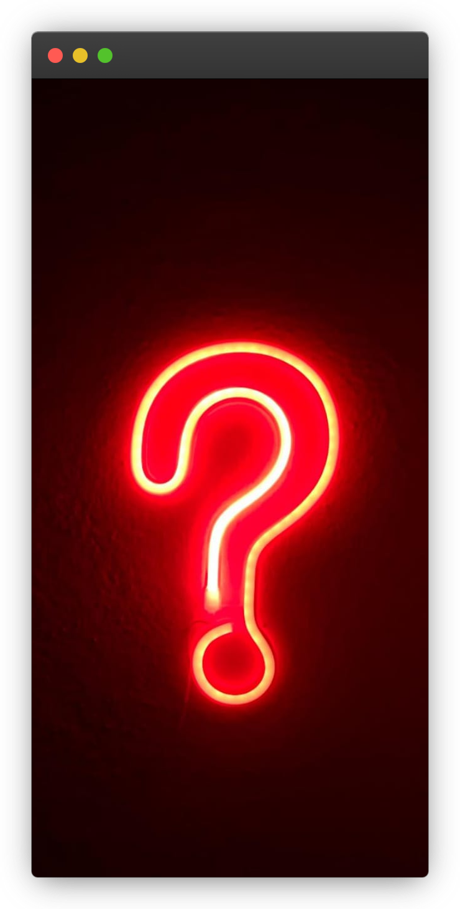
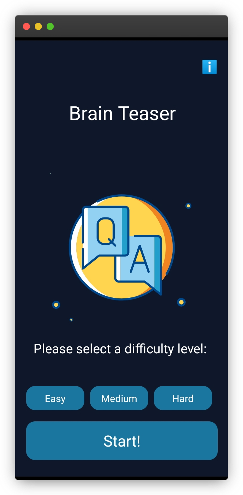
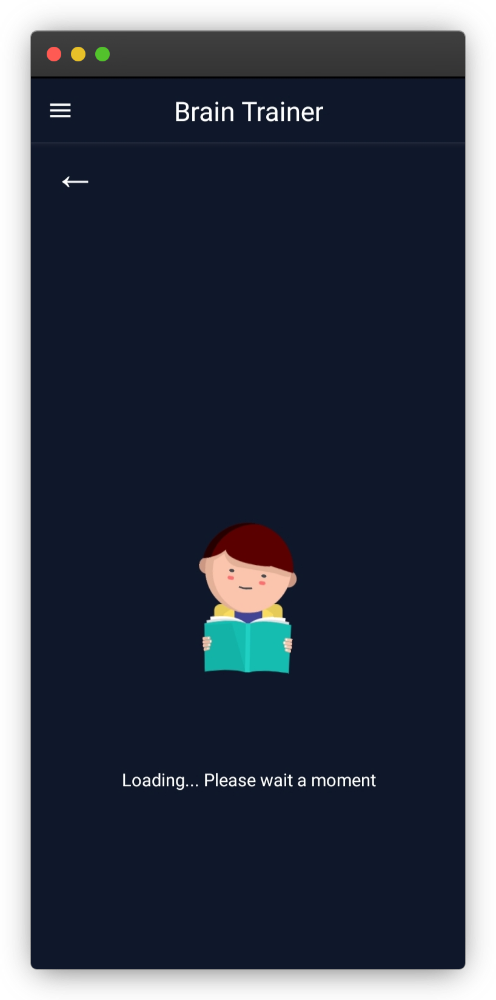
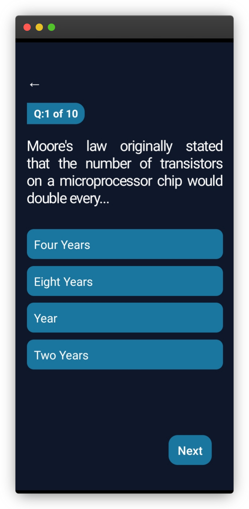
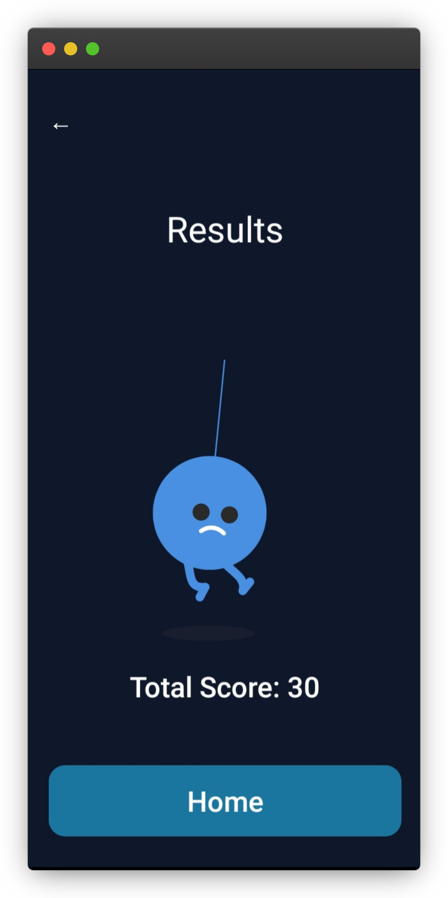
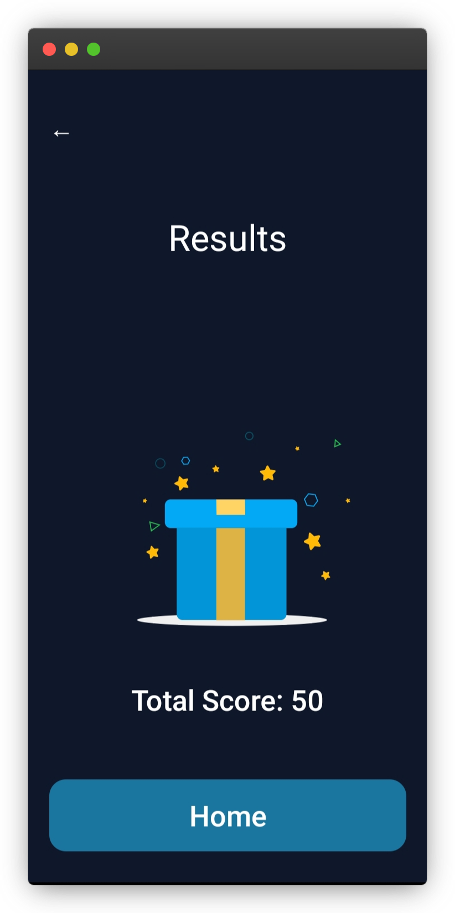
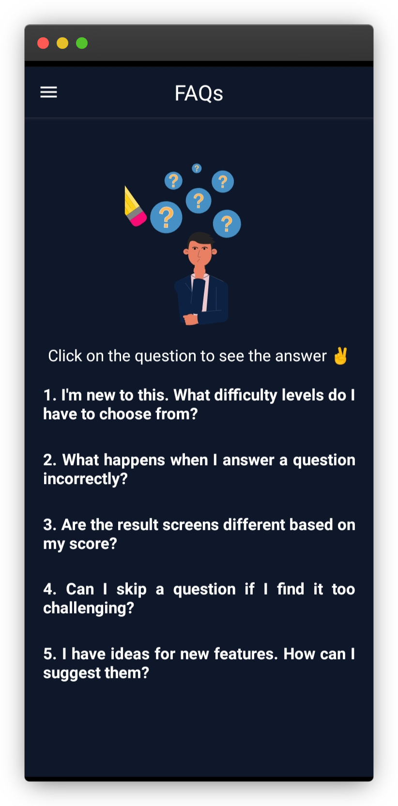
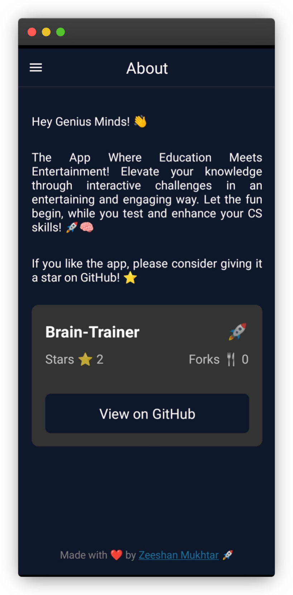

<h1 align="center" id="title">Brain Train</h1>

Quiz app for iOS and Android built with React Native, featuring multiple-choice questions, difficulty levels, and vibrate mode for real-time feedback on incorrect answers.

<h2 align="center">🧐 Features</h2>

Here are some key features of the project:

- Multiple Choice Questions
- Difficulty Levels (Easy, Medium, Hard)
- Vibrate Mode for Real-time Feedback
- Minimalist Design
- eye catching UI
- iOS and Android
- Faq Section for Common Questions
- Dynamic Scoreboard
- Splash Screen
- Loading Screen
- Real time repository statistics

<h2 align="center">💻 Built with</h2>

Technologies used in the project:

- Typescript
- Javascript
- CSS

Technologies used in the project:

- React Native CLI
- React Native
- React Navigation
- React Native Vibration

<h2 align="center">Screenshots</h2>

  <table>
    <tr>
      <td align="center"></td>
      <td align="center"></td>
    </tr>
       <tr>
      <td align="center"></td>
      <td align="center"></td>
    </tr>
    <tr>
      <td align="center"></td>
      <td align="center"></td>
    </tr>
    <tr>
      <td align="center"></td>
      <td align="center"></td>
    </tr>
    <tr>
      <td align="center"></td>
    </tr>

  </table>

<h2 align="center">Releases 🚀</h2>

- [v1.0.0](https://github.com/ZeeshanMukhtar1/BrainTrain-Native/releases/tag/v1.0.0) - Download apk

<h2 align="center"> Connect with Me 👋</h2>

We appreciate your support and hope you enjoy using our quiz app! Thank you for choosing Brain Train.

## Acknowledgments

Thank you for choosing our quiz app. We hope you have a great time testing your knowledge and skills!

<h2 align="center">🛡️ License:</h2>

This project is licensed under the [MIT License](/LICENSE).

---
